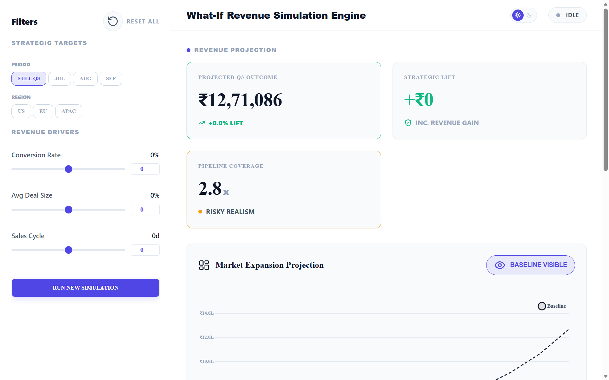
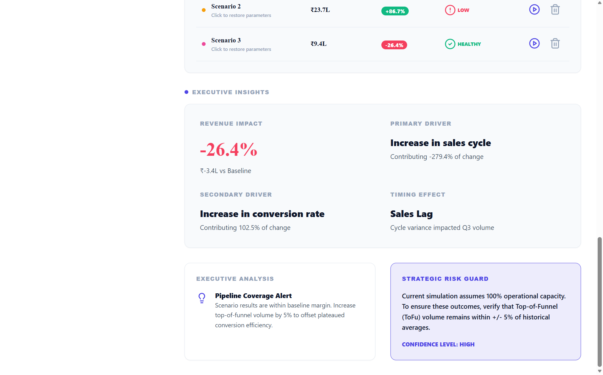
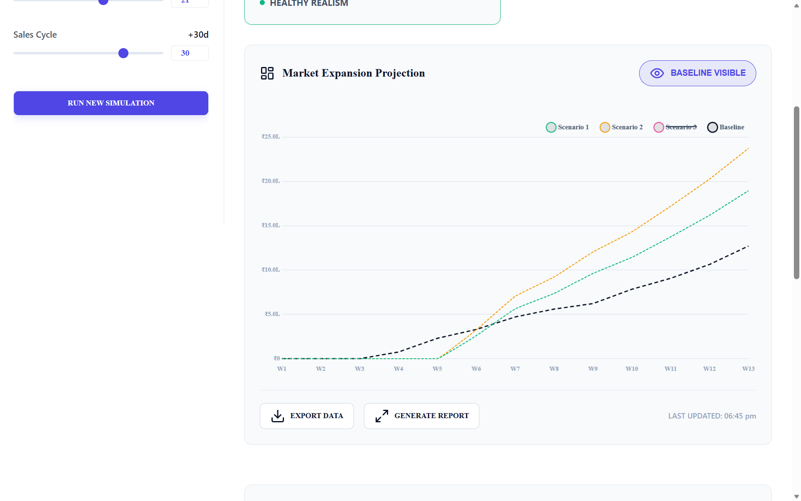

# SkyGeni: Revenue Simulation Engine

SkyGeni is a high-fidelity, full-stack "What-If" simulation tool designed for sales leadership to forecast Q3 revenue outcomes. By applying dynamic parameters to existing pipeline data, it projects future performance grounded in historical Q1/Q2 analytics.

---

## 📽️ Prototype Demonstration

### [Watch the Demo Video (Google Drive)](https://drive.google.com/file/d/1N5EDviwipeIvAkwKAIXEgd5xlmsI02-m/view?usp=drive_link)
*(Total Duration: < 2 Minutes)*

---

## 🖼️ Visual Gallery

> [!NOTE]
> All high-resolution screenshots are available in the [**`/assets`**](./assets) directory of this repository.

### High-Fidelity Dashboard (Light Mode)


### Revenue Projection & Logic


### Interactive Simulation & Insights


---

## Installation & Setup

### Prerequisites
- Node.js (v18 or higher)
- npm

### 1. Repository Structure
Ensure you have the following folder structure:
- `/backend`: Node.js/Express server (Simulation Engine)
- `/frontend`: React/Vite client (Interactive UI)

### 2. Backend Setup
```bash
cd backend
npm install
npm run dev
```
*The server will start on `http://localhost:3001`.*

### 3. Frontend Setup
```bash
cd frontend
npm install
npm run dev
```
*The application will be available at `http://localhost:5173`.*

---

## Core Assumptions & Logic

1.  **Baseline Metrics**: Calculated using all deals created and closed in **Q1 and Q2** (Jan 2025 – June 2025). This establishes the conversion rate (CR) and average deal size (ADS) foundations.
2.  **Q3 Target Boundary**: The simulation focuses exclusively on deals where `created_date` falls within **July 1 – September 30, 2025**.
3.  **Global Simulation Formula**: 
    -   `Volume = Pipeline Count × Conversion Rate (Scenario) × Avg Deal Size (Scenario)`.
4.  **Temporal Realism**: The **Sales Cycle** adjustment primarily shifts the **timing** of revenue realization across the 13 weeks of Q3 without affecting the total outcome volume.
5.  **Mathematical Normalization**: Bottom-up deal projections are normalized to ensure the sum of weekly values precisely matches the results generated by the global "What-If" formula.
6.  **Conversion Capping**: Scenario-based conversion rates are capped at **100% (1.0)** to prevent unrealistic projections.

---

## Key Inferences

- **Pipeline Coverage Ratio**: Calculated as `Total Pipeline Value / Projected Revenue`. A ratio of ~3.0x is considered "Healthy," while lower ratios indicate significant execution risk.
- **Strategic Lift**: Quantifies the incremental revenue gain specifically attributable to the simulated improvements in sales efficiency (CR, ADS, Velocity).
- **Normalized Weekly Weighting**: The system uses a probabilistic distribution of history to weight which weeks within Q3 are most likely to convert based on individual deal creation dates.

---

## Folder Structure
- `/backend`: TypeScript Express server handling simulation logic and CSV processing.
- `/frontend`: React dashboard featuring Chart.js and Framer Motion integration.
- `deals.csv`: Dataset used for historical baseline and Q3 pipeline modeling.
